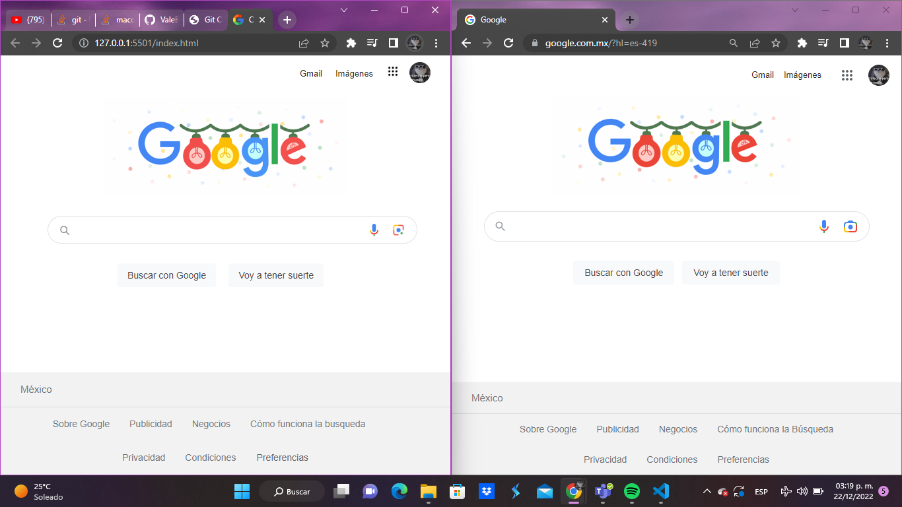
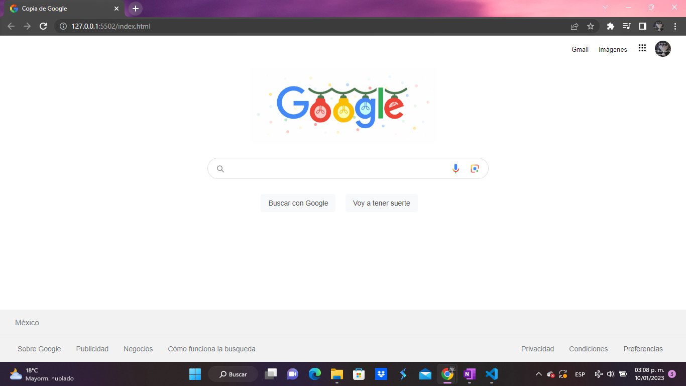
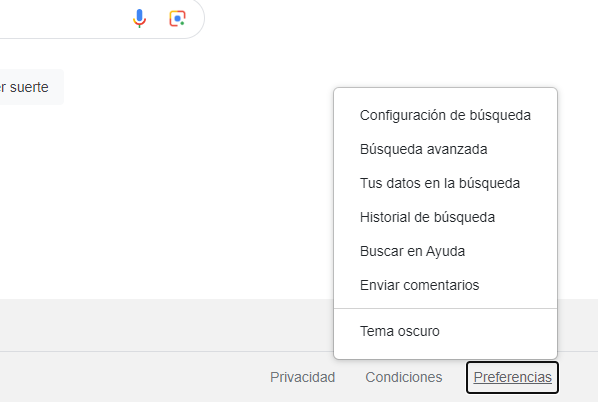

# Clonación de Google

Este proyecto creado para el bootcamp Tecnolochicas PRO, es una clonación de la página de inicio de Google. 

El propósito de esta página es tartar de asemejar visualmente lo más que se pueda a la página de Google utilizando HTML y CSS

### Capturas de pantalla:

